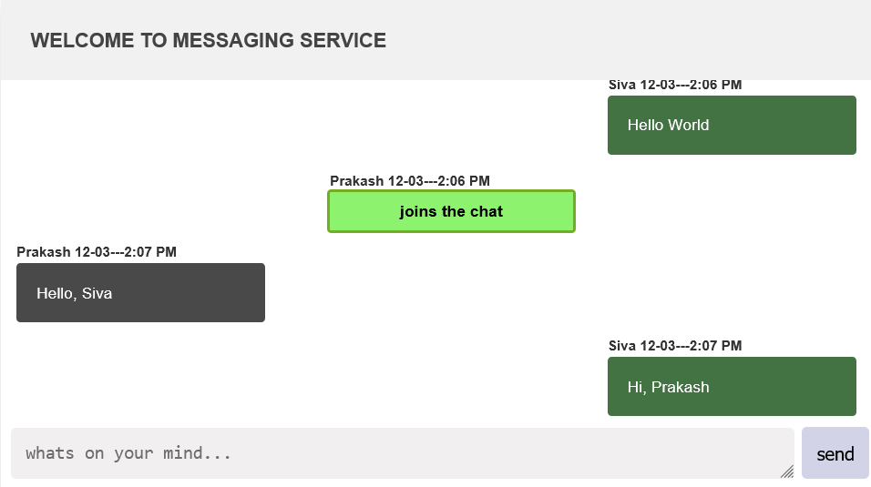

# Express Chat Application


Live chat web application with a minimal features like chat room creation, joining already created chat room and live chatting with multiple users.

## Prerequisites
Before you can run this project, you need to have the following installed:
- Node.js (version 14.0 or later)
- Typescript (version 4.9.5 or later)
- TS Node (version 10.9.1 or later)

## Installation
To install this project, follow these steps:
Clone the repository using `git`
```
git clone https://github.com/Prakashdeveloper03/Express-Chat.git
```
Navigate to the root directory of the project
```
cd <directory_name>
```
To install all the dependencies
```
npm install
```
Run the `server.ts` file
```
npm run dev
```

## 📷 Screenshot
